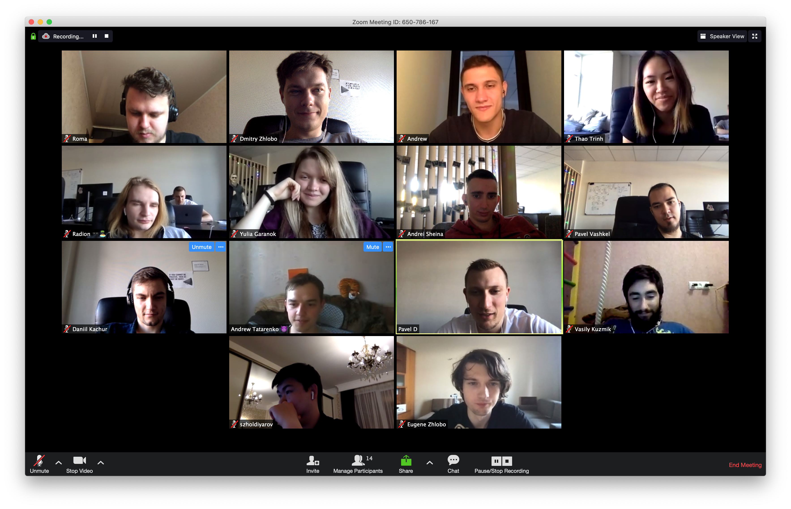
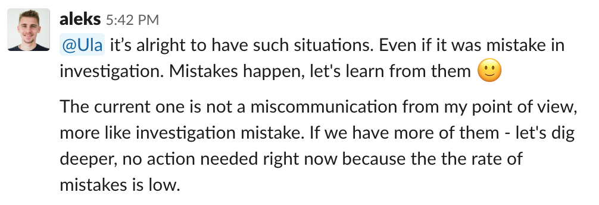
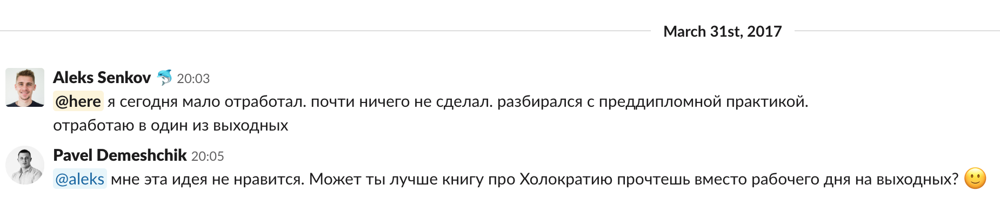

We build products for our clients.

* [How We Work](#how-we-work)
  * [Remote](#remote)
  * [People First](#people-first)
  * [Work as a team with clients](#work-as-a-team-with-clients)
* [Our Clients](#our-clients)
* [Work With Us](#work-with-us)
  * [Jobs](#jobs)
    * 🔥 [Ruby Developer (Middle)](jobs/ruby/middle-ruby-developer.md)
    * 🔥 [Ruby Developer (Junior)](jobs/ruby/junior-ruby-developer.md)
    * 🔥 [Experienced Frontend Developer](jobs/experienced-frontend-developer.md) 
    * [Mobile Developer (Android/iOS)](jobs/mobile-developer.md)
    <!--- * [Experienced Node.js Developer](jobs/experienced-nodejs-developer.md) --->
    
    <!--- * 🔥 [Sales & Account Manager](jobs/sales-account-manager.md) ---> 
    
    
  * [Apprenticeship](#apprenticeship)
  * [Interview Process](#interview-process)
  * [FAQ](#FAQ)
  

Ask us anything — create an issue in this repository with your questions and we'll answer.

## How We Work

### Remote

🇧🇾 🇨🇦 🇵🇱 🇷🇺 🇲🇩 🇦🇲 🇰🇿 🇺🇿 🇺🇦 🇦🇿 🇰🇬 ([add yours](#work-with-us))

We work remotely. It's a common comment that it requires a lot of self-discipline to work remotely. We believe it is more about good processes and habits.
See how datarockets company evolved.

https://user-images.githubusercontent.com/87384373/158373637-1bd6e48b-1300-40c1-8aa6-34a49b3c136b.mp4

Good processes is something we've been working on for the last seven years. We moved our conversations to chats. We make calls for pair programming and discussing tasks in real time but always write a summary after the call.

It's important to be pro-active and inform everyone about things you do and obstacles you have even if nobody asks.

We believe that it's much easier to work together when you know your teammates personally, not only their work skills. It is easier to ask someone for help quickly if you were discussing a recent movie premier just yesterday.

In order to make people know each other better we have biweekly check-ins — an all hands one hour long call where we share what happened with us during the last week: last book we read, a new place we visited, family event we had. datarockers gather in small groups by interest like tech meetups or bookclub. You can find some of our activities on youtube, like [bookclub](https://www.youtube.com/playlist?list=PLXylrdLh4cnDxvdJigtYWqQvIW4yARbOX).

Twice a year we organize a party and bring everyone to it. We spend time together and chat a lot. That's very interesting time since we have people from different cultures. You can learn how traditional wedding parties look like in Vietnam and how to cook lagman.

### People First

People make mistakes, nobody is perfect. Nobody gets punished or gets blamed for making a mistake at datarockets. What's important is to learn from mistakes we make.

We understand that "shit happens". Some days we just feel off, procrastinate instead of working, can't get anything done. We promote to take such days off and we never allow to work late hours or on weekend to make up.

Working on a weekend is always a bad option. We never agree when clients ask for overtime work. We offer to use our creativity to find out how we can lauch on time w/o overtime: cut unimportant tasks from scope, do something by hand in the beginning instead of automation, etc.

It is not allowed to work on weekend or overtime at datarockets.

### Work as a team with clients

We care about products we work on, it is unacceptable to just do what you've been told to do when you have concerns and others are not aware of them.

datarockets chooses clients that want to work with us as a single team. We create a Slack workspace per project where everyone, client people and developers chat together. Everyone in the team can ask a question from client directly or initiate a video call meeting at any time.

Client can see how we discuss tasks, how we overcome obstacles, how we make mistakes and learn from them. We don't hide discussions of our mistakes from clients. It creates a lot of trust.

Sometimes clients visit us (in different cities) and sometimes we visit them.

## Our Clients

datarockets builds web and mobile applications for startups and businesses. We launch first version of product to confirm that idea is viable and help with existing product development to increase number of users and profit.

We work with clients for years. See [case studies](https://datarockets.com/case-studies/) in order to learn more about the projects we work with.

## Work With Us

### Jobs

- [Experienced Frontend Developer](jobs/experienced-frontend-developer.md)
- [Ruby Developer (Junior)](jobs/ruby/junior-ruby-developer.md)
- [Ruby Developer (Middle)](jobs/ruby/middle-ruby-developer.md)
- [Experienced Node.js Developer](jobs/experienced-nodejs-developer.md) 
 <!--- [Mobile Developer (Android/iOS)](jobs/mobile-developer.md)---> 
 

Sometimes we don't have open job positions but it's still worth to get in contact with us if you're interested in working with us.

Email us on [join@datarockets.com](mailto:join@datarockets.com). Write us about your experience in development, show examples of your code. Tell us what you would like to see in a company you'd love to work at, what is important for you.

### Apprenticeship

At datarockets we're happy to work with junior and intern developers. Please check [Apprenticeship](apprenticeship.md) to find more details and see how you can work with us if you are a junior.

## Interview Process

- We have 3-steps interview process. During the process we discuss different things: education, courses, books, articles, and blogs; application architecture, libraries, frameworks, and code snippets; we touch teams, colleagues, and clients. Basically, we are curious about your interests and way of thinking. And we are happy to share ours.

- We're not looking for correct answers or for a candidate to agree with our views on particular topics. Sometimes the best answer is "I don't know". We love responses like "I don't know but I think ...". We're looking for a great conversation, the one we might have on a conference afterparty.

- Also, we love questions. Don't forget to bring them to the conversation as well.

- We chat in English.

- Please maintain the same subject during the conversation and don't exclude participants (use reply-all).

- If you understand that we don't match feel free to stop and provide your feedback at any time to save your and our time. We would do the same from our side.

- We record the interviews in order to have the opportunity to improve the process and come back to the topics we discussed. We can send the recording after the interview to the candidate by request. We do not record interviews if the candidate asked us not to do it.

### 1. Conversation with HR

We chat on email or other social/professional network and then we chat on video-interview. We ask questions about previous projects, current stage of your development, interests, preferencies. We share more about us and answer you first questions.

### 2. Video-chats with datarockers (Technical part)

Every datarocker has its own style and own plan for interviewing people. At this step candidates may expect to do some pair-programming and real world project problem solving.

### 3. Video-chat with the vacancy owner (Overall part)

Expect to have deep conversations about technologies and development experience. There are usually a problem-solving discusions, related to technologies and people.

## FAQ 

### - I want to become Team Lead. Is there any career path for that?

Definitely, we would love to work with people who want to take responsibility for projects and teams. We won't put a newcomer to a team leader role at the beginning but during our work together we keep in mind career goals and try to give me challenges that help people to grow in desired direction. So we can envision something like this: the newcomer starts as an individual contributor, solve tasks on the project, when the person feels confident enough we'd expect from them to give more and more contribution to processes: be pro-active, suggest tech improvements, suggest team and processes improvements, then they might start discuss deliveries and take part in planning, then start helping teammates with their careers. You kind of need to convince us that you might be a person we can rely on and that's how you become a team leader.

### - Do we have a project manager?

No, it depends on the project. Sometimes our clients manage the development team on their side - mostly in cases when we work as a dedicated team with their in-house team. When the client is a tech person himself, only a lead developer/team lead may be required from our side to lead the dev team. Whereas, our CEO/CTO/Project manager will still cover organizational/payment/feedback questions. So each case is specific. Lately, our PM was covering 3 out of 5 ongoing projects.

### - Who is responsible for managing tasks between the team members?

Project manager/lead developer/client himself. Depends on the client, project complexity and the team size.

### - Who is responsible for the communication with a client within the team?

High-level communication happens with our CEO/CTO/Project manager or a crisis-manager. Development-related communication is transparent and involves the whole team. We work with clients as a single team and help to build products, not just writing code. Therefore, our developers are self-sufficient developers who can speak to the client directly, clarify questions and suggest their ideas on how to make a product better. So the communication happens openly and all team members participate in it. Plus, as we are a Holacracy-driven organization, on each project we have roles such as facilitator, rep link, circle lead, etc. that are distributed among the team members and help us to have a stable work and communication process.

### - Which methodology do you follow?

At datarockets, we never followed one methodology strictly. We mix them and take useful practices from all approaches. Also every project is unique. Usually the planning goes together with the client and developers where we discuss the priority of the tasks and come up with the list of tasks for an certain period of time (week/2 weeks/etc - depending on the client). Most importantly is that developers take part in these call, they share their opinions and possible estimates. We never make decisions about the scope of work and the deadlines without the transparent discussion with devs. Also, our clients and devs know that if something doesn’t go as planned, we always discuss it together and find ways what we can do in this situation. This all sounds like Agile.

### - Do the developers work on support tasks?

We only work full time on the projects, so if the project needs support for a couple of hours a week, we don’t do this. When delivering the final tasks we make sure that the tests are written and the app is stable. After the end of the main project, if the client collects a list of tasks for a full iteration/sprint/whatever - either new features or agrees for refactoring, we allocate 2 our engineers who worked on this project before to work full-time and complete the additional iteration. Of course, if the developers are busy on another project, the client will wait until they finish the current one.

