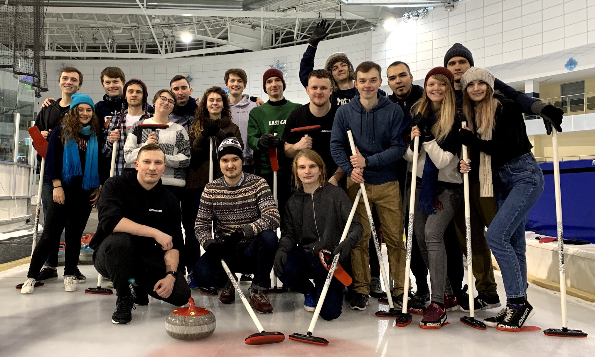

Мы делаем веб и мобильные приложения для стартапов и бизнесов. Обычно это запуск первой версии для проверки идеи или развитие проекта для увеличения количества пользователей или прибыли.

У нас всегда честные, открытые и хорошие рабочие отношения с клиентами. Мы не обманываем и не юлим перед клиентами, не скрываем информацию. Команда работает только на одном проекте. Проблемы и решения обсуждаем открыто на ретроспективах раз в две недели.

Ценим в людях самостоятельность и инициативность. Это значит, что не нужно всегда сторого выполнять задачи так, как они описаны. Если есть сомнения, любую задачу можно и нужно обсуждать напрямую с командой клиента и задавать любые вопросы.

Каждую неделю проводим митапы, на которых обсуждаем технические задачи, фреймворки и подходы. Иногда [шарим видео](https://www.youtube.com/channel/UC3FaevGv94T9zvtHlL9ch1g/videos) митапов на ютубе.

(скриншот из внутреннего форума)

Можно поменять процессы путем создания пулреквеста в плейбук:

(скриншот оглавления в плейбуке)

Работаем удаленно (можно из офиса в Минске) и поэтому необходимо много общаться в трекере задач и в чате. Нужно рассказывать о своей работе и делать ее видимой, даже если об этом никто не спрашивает. Два раза в год собираемся в одном месте потусить

(съезд датарокеров в январе 2019, больше фото в [инстаграме](https://www.instagram.com/datarockets/))

## Ищем рубиста

Ищем руби-разработчиков для работы над веб-приложениями. Хотим работать с инициативными и самостоятельными людьми, которые будут предлагать идеи и улучшения проектов, команды и компании.

### Наши требования

* У вас есть опыт работы на проектах. Вы знаете подходы, паттерны и библиотеки, которые позволяют писать хороший поддерживаемый код.
* Хорошие знания Ruby on Rails: знаете из каких компонентов состоят приложения, как фреймворк помогает нам писать безопасный код и какие полезные фичи позволяют нам писать меньше кода.
* Умеете писать тесты и знаете как добиться высокого покрытия.
* Умеете проектировать и работать с базами данных. Понимаете, что такое нормализация, можете написать запрос данных из нескольких таблиц и знаете какие могут быть связи между таблицами.
* Умение верстать и программировать интерфейсы на HTML, CSS и JavaScript: понимаете, что такое DOM-дерево и как его изменять в зависимости от действий пользователя.
* Знаете как работает веб и протокол HTTP: какие запросы бывают и чем отличаются, как сервера и веб-приложения распознают пользователей и т.п.
* Владете инструментами для разработки приожений: командная строка, гит, отладчик.
* Хороший английский: мы общаемся на английском каждый день с командой и с клиентами.

### Бонусы

* Оплата 50% расходов на персональное развитие: курсы, конференции, образовательные сервисы, английский. И настойчиво предлагаем эти курсы проходить.
* Компенсация 50% расходов на физкультуру.
* Оплата медицинских расходов до 200$ в год.
* Предложите свой ;).

### Отклик

Пришлите рассказ о себе и своем опыте в разработке на [join@datarockets.com](mailto:join@datarockets.com). Покажите примеры вашего кода. Расскажите, что вам важно в компании и команде, в которой вы хотите работать.
